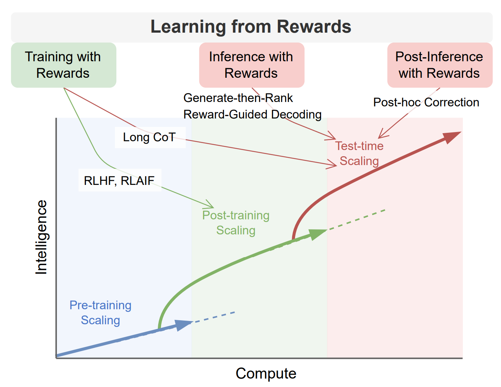
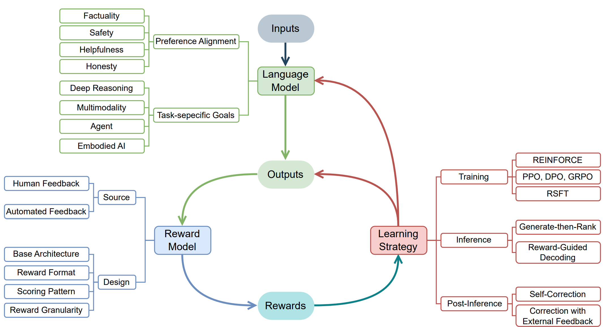

# 📚Learning-from-Rewards LLM Papers

[](https://github.com/bobxwu/learning-from-rewards-llm-papers)
[](https://arxiv.org/pdf/2505.02686)
[](https://opensource.org/licenses/MIT)
[](https://github.com/bobxwu/learning-from-rewards-llm-papers/graphs/contributors/)


This repository collects research papers on *learning from rewards* in the context of post-training and test-time scaling of large language models (LLMs).


Our survey paper: [Sailing AI by the Stars: A Survey of Learning from Rewards in Post-Training and Test-Time Scaling of Large Language Models](https://arxiv.org/pdf/2505.02686).


<p align="center">
  
  <br/><em>Figure 1: Scaling phases of LLMs.</em><br/><br/>
  <br/>
  
  <br/><em>Figure 2: Conceptual framework of learning from rewards.</em>
</p>


- [📚Learning-from-Rewards LLM Papers](#learning-from-rewards-llm-papers)
  - [🎯Training with Rewards](#training-with-rewards)
    - [Training with Scalar Rewards](#training-with-scalar-rewards)
    - [Training with Critique Rewards](#training-with-critique-rewards)
    - [Training with Implicit Rewards](#training-with-implicit-rewards)
    - [Training with Rule-based Rewards](#training-with-rule-based-rewards)
    - [Training with Process Rewards](#training-with-process-rewards)
  - [🎯Inference with Rewards](#inference-with-rewards)
    - [Generate-then-Rank](#generate-then-rank)
    - [Reward-Guided Decoding](#reward-guided-decoding)
  - [🎯Post-Inference with Rewards](#post-inference-with-rewards)
    - [Self-Correction](#self-correction)
    - [Correction with External Feedback](#correction-with-external-feedback)
  - [📏Benchmarking Reward Models](#benchmarking-reward-models)
    - [Benchmarking Outcome Reward Models](#benchmarking-outcome-reward-models)
    - [Benchmarking Process Reward Models](#benchmarking-process-reward-models)
    - [Benchmarking Multimodal Reward Models](#benchmarking-multimodal-reward-models)
    - [Other Benchmarks](#other-benchmarks)
  - [🚀Applications](#applications)
    - [Preference Alignment](#preference-alignment)
    - [Mathematical Reasoning](#mathematical-reasoning)
    - [Code Generation](#code-generation)
    - [Multimodal Tasks](#multimodal-tasks)
    - [Agents](#agents)
    - [Other Applications](#other-applications)
  - [💡Challenges and Future Directions](#challenges-and-future-directions)
  - [📬Contact](#contact)
  - [📖Citation](#citation)


## 🎯Training with Rewards


### [Training with Scalar Rewards]()

- **Proximal policy optimization algorithms**. arXiv, 2017. [paper](https://arxiv.org/pdf/1707.06347)

- **Fine-Tuning Language Models from Human Preferences**. arXiv, 2019. [paper](https://arxiv.org/pdf/1909.08593)

- **Constitutional AI: Harmlessness from AI feedback**. arXiv, 2022. [paper](https://arxiv.org/pdf/2212.08073)

- **Training a helpful and harmless assistant with reinforcement learning from human feedback**. arXiv, 2022. [paper](https://arxiv.org/pdf/2204.05862)

- **Improving alignment of dialogue agents via targeted human judgements**. arXiv, 2022. [paper](https://doi.org/10.48550/arXiv.2209.14375)

- **Training language models to follow instructions with human feedback**. NeurIPS, 2022. [paper](https://proceedings.neurips.cc/paper_files/paper/2022/file/b1efde53be364a73914f58805a001731-Paper-Conference.pdf)

- **Safe rlhf: Safe reinforcement learning from human feedback**. arXiv, 2023. [paper](https://arxiv.org/pdf/2310.12773)

- **RLTF: Reinforcement Learning from Unit Test Feedback**. TMLR, 2023. [paper](https://openreview.net/forum?id=hjYmsV6nXZ)

- **Aligning large multimodal models with factually augmented rlhf**. arXiv, 2023. [paper](https://arxiv.org/pdf/2309.14525)

- **Fine-grained human feedback gives better rewards for language model training**. arXiv, 2023. [paper](https://arxiv.org/pdf/2306.01693)

- **Human preference score: Better aligning text-to-image models with human preference**. arXiv, 2023. [paper](https://arxiv.org/pdf/2303.14420)

- **Human preference score v2: A solid benchmark for evaluating human preferences of text-to-image synthesis**. arXiv, 2023. [paper](https://arxiv.org/pdf/2306.09341)

- **Imagereward: Learning and evaluating human preferences for text-to-image generation**. arXiv, 2023. [paper](https://arxiv.org/pdf/2304.05977)

- **Tuning large multimodal models for videos using reinforcement learning from ai feedback**. arXiv, 2024. [paper](https://arxiv.org/pdf/2402.03746)

- **Stepcoder: Improve code generation with reinforcement learning from compiler feedback**. arXiv, 2024. [paper](https://arxiv.org/pdf/2402.01391)

- **RLEF: Grounding Code LLMs in Execution Feedback with Reinforcement Learning**. arXiv, 2024. [paper](https://arxiv.org/pdf/2410.02089)

- **Rich human feedback for text-to-image generation**. arXiv, 2024. [paper](https://arxiv.org/pdf/2312.10240)

- **Skywork-reward: Bag of tricks for reward modeling in llms**. arXiv, 2024. [paper](https://arxiv.org/pdf/2410.18451)

- **Lift: Leveraging human feedback for text-to-video model alignment**. arXiv, 2024. [paper](https://arxiv.org/pdf/2412.04814)

- **Self-taught evaluators**. arXiv, 2024. [paper](https://arxiv.org/pdf/2408.02666)

- **REINFORCE++: A Simple and Efficient Approach for Aligning Large Language Models**. arXiv, 2025. [paper](https://arxiv.org/pdf/2501.03262)

- **Learning to Reason under Off-Policy Guidance**. arxiv, 2025. [paper](https://arxiv.org/pdf/2504.14945)

- **VinePPO Refining Credit Assignment in RL Training of LLMs**. arXiv, 2025. [paper](https://arxiv.org/pdf/2410.01679)


### [Training with Critique Rewards]()
- **Judging llm-as-a-judge with mt-bench and chatbot arena**. arXiv, 2023. [paper](https://arxiv.org/pdf/2306.05685)

- **Generative judge for evaluating alignment**. arXiv, 2023. [paper](https://arxiv.org/pdf/2310.05470)

- **Critique-out-loud reward models**. arXiv, 2024. [paper](https://arxiv.org/pdf/2408.11791)

- **Compassjudger-1: All-in-one judge model helps model evaluation and evolution**. arXiv, 2024. [paper](https://arxiv.org/pdf/2410.16256)

- **Llm critics help catch bugs in mathematics: Towards a better mathematical verifier with natural language feedback**. arXiv, 2024. [paper](https://arxiv.org/pdf/2406.14024)

- **Direct judgement preference optimization**. arXiv, 2024. [paper](https://arxiv.org/pdf/2409.14664)

- **Llava-critic: Learning to evaluate multimodal models**. arXiv, 2024. [paper](https://arxiv.org/pdf/2410.02712)

- **Beyond Scalar Reward Model: Learning Generative Judge from Preference Data**. arXiv, 2024. [paper](https://arxiv.org/pdf/2410.03742)

- **Self-Generated Critiques Boost Reward Modeling for Language Models**. arXiv, 2024. [paper](https://arxiv.org/pdf/2411.16646)

- **Generative verifiers: Reward modeling as next-token prediction**. arXiv, 2024. [paper](https://arxiv.org/pdf/2408.15240)

- **Inference-Time Scaling for Generalist Reward Modeling**. arXiv, 2025. [paper](https://arxiv.org/pdf/2504.02495)

- **Mm-rlhf: The next step forward in multimodal llm alignment**. arXiv, 2025. [paper](https://arxiv.org/pdf/2502.10391)

- **Improve LLM-as-a-Judge Ability as a General Ability**. arXiv, 2025. [paper](https://arxiv.org/pdf/2502.11689)


### [Training with Implicit Rewards]()
- **Training a helpful and harmless assistant with reinforcement learning from human feedback**. arXiv, 2022. [paper](https://arxiv.org/pdf/2204.05862)

- **Raft: Reward ranked finetuning for generative foundation model alignment**. arXiv, 2023. [paper](https://arxiv.org/pdf/2304.06767)

- **Reinforced Self-Training (ReST) for Language Modeling**. arXiv, 2023. [paper](https://arxiv.org/pdf/2308.08998)

- **Making language models better tool learners with execution feedback**. arXiv, 2023. [paper](https://arxiv.org/pdf/2305.13068)

- **Direct preference optimization: Your language model is secretly a reward model**. arXiv, 2023. [paper](https://arxiv.org/pdf/2305.18290)

- **RLHF-V: Towards Trustworthy MLLMs via Behavior Alignment from Fine-grained Correctional Human Feedback**. arXiv, 2023. [paper](https://arxiv.org/pdf/2312.00849)

- **Rrhf: Rank responses to align language models with human feedback without tears**. arXiv, 2023. [paper](https://arxiv.org/pdf/2304.05302)

- **Beyond Hallucinations: Enhancing LVLMs through Hallucination-Aware Direct Preference Optimization**. arXiv, 2023. [paper](https://arxiv.org/pdf/2311.16839)

- **KTO: Model Alignment as Prospect Theoretic Optimization**. arXiv, 2024. [paper](https://arxiv.org/pdf/2402.01306)

- **Preference Optimization for Reasoning with Pseudo Feedback**. arXiv, 2024. [paper](https://arxiv.org/pdf/2411.16345)

- **Step-DPO: Step-wise preference optimization for long-chain reasoning of llms**. arXiv, 2024. [paper](https://arxiv.org/pdf/2406.18629)

- **Flame: Factuality-aware alignment for large language models**. arXiv, 2024. [paper](https://arxiv.org/pdf/2405.01525)

- **Simpo: Simple preference optimization with a reference-free reward**. arXiv, 2024. [paper](https://arxiv.org/pdf/2405.14734)

- **Strengthening Multimodal Large Language Model with Bootstrapped Preference Optimization**. arXiv, 2024. [paper](https://arxiv.org/pdf/2403.08730)

- **Self-Consistency Preference Optimization**. arXiv, 2024. [paper](https://arxiv.org/pdf/2411.04109)

- **CodeLutra: Boosting LLM Code Generation via Preference-Guided Refinement**. arXiv, 2024. [paper](https://arxiv.org/pdf/2411.05199)

- **Diffusion model alignment using direct preference optimization**. arXiv, 2024. [paper](https://arxiv.org/pdf/2311.12908)

- **mdpo: Conditional preference optimization for multimodal large language models**. arXiv, 2024. [paper](https://arxiv.org/pdf/2406.11839)

- **Meta-rewarding language models: Self-improving alignment with llm-as-a-meta-judge**. arXiv, 2024. [paper](https://arxiv.org/pdf/2407.19594)

- **RLAIF-V: Aligning MLLMs through Open-Source AI Feedback for Super GPT-4V Trustworthiness**. arXiv, 2024. [paper](https://doi.org/10.48550/arXiv.2405.17220)

- **Self-Rewarding Language Models**. arXiv, 2024. [paper](https://arxiv.org/pdf/2401.10020)

- **Aligning Modalities in Vision Large Language Models via Preference Fine-tuning**. arXiv, 2024. [paper](https://arxiv.org/pdf/2402.11411)

- **Unified Reward Model for Multimodal Understanding and Generation**. arXiv, 2025. [paper](https://arxiv.org/pdf/2503.05236)

- **RefineCoder: Iterative Improving of Large Language Models via Adaptive Critique Refinement for Code Generation**. arXiv, 2025. [paper](https://arxiv.org/pdf/2502.09183)


### [Training with Rule-based Rewards]()
- **Deepseekmath: Pushing the limits of mathematical reasoning in open language models**. arXiv, 2024. [paper](https://arxiv.org/pdf/2402.03300)

- **Deepseek-r1: Incentivizing reasoning capability in llms via reinforcement learning**. arXiv, 2025. [paper](https://arxiv.org/pdf/2501.12948)

- **Improving Generalization in Intent Detection: GRPO with Reward-Based Curriculum Sampling**. arXiv, 2025. [paper](https://arxiv.org/pdf/2504.13592)

- **Open r1: A fully open reproduction of deepseek-r1**. GitHub, 2025. [paper](https://github.com/huggingface/open-r1)

- **CLS-RL: Image Classification with Rule-Based Reinforcement Learning**. arXiv, 2025. [paper](https://arxiv.org/pdf/2503.16188)

- **Visual-rft: Visual reinforcement fine-tuning**. arXiv, 2025. [paper](https://arxiv.org/pdf/2503.01785)

- **Logic-rl: Unleashing llm reasoning with rule-based reinforcement learning**. arXiv, 2025. [paper](https://arxiv.org/pdf/2502.14768)

- **Not All Rollouts are Useful: Down-Sampling Rollouts in LLM Reinforcement Learning**. arXiv, 2025. [paper](https://arxiv.org/pdf/2504.13818)

- **Dapo: An open-source llm reinforcement learning system at scale**. arXiv, 2025. [paper](https://arxiv.org/pdf/2503.14476)

- **R1-vl: Learning to reason with multimodal large language models via step-wise group relative policy optimization**. arXiv, 2025. [paper](https://arxiv.org/pdf/2503.12937)

- **Right Question is Already Half the Answer: Fully Unsupervised LLM Reasoning Incentivization**. arXiv, 2025. [paper](https://arxiv.org/pdf/2504.05812)

- **TTRL: Test-Time Reinforcement Learning**. arXiv, 2025. [paper](https://arxiv.org/pdf/2504.16084)

- **Spurious Rewards Rethinking Training Signals in RLVR**. arXiv, 2025. [paper](https://github.com/ruixin31/Rethink_RLVR)


### [Training with Process Rewards]()
- **WizardMath: Empowering Mathematical Reasoning for Large Language Models via Reinforced Evol-Instruct**. arXiv, 2023. [paper](https://doi.org/10.48550/arXiv.2308.09583)

- **Math-shepherd: Verify and reinforce llms step-by-step without human annotations**. arXiv, 2023. [paper](https://arxiv.org/pdf/2312.08935)

- **Process reward model with q-value rankings**. arXiv, 2024. [paper](https://arxiv.org/pdf/2410.11287)

- **Diving into Self-Evolving Training for Multimodal Reasoning**. arXiv, 2024. [paper](https://arxiv.org/pdf/2412.17451)

- **Improve mathematical reasoning in language models by automated process supervision**. arXiv, 2024. [paper](https://arxiv.org/pdf/2406.06592)

- **Process reinforcement through implicit rewards**. arXiv, 2025. [paper](https://arxiv.org/pdf/2502.01456)

- **Efficient Process Reward Model Training via Active Learning**. arXiv, 2025. [paper](https://arxiv.org/pdf/2504.10559)

- **Process Reward Models That Think**. arXiv, 2025. [paper](https://arxiv.org/pdf/2504.16828)

- **Exploring the Limit of Outcome Reward for Learning Mathematical Reasoning**. arXiv, 2025. [paper](https://arxiv.org/pdf/2502.06781)

- **R-PRM: Reasoning-Driven Process Reward Modeling**. arXiv, 2025. [paper](https://arxiv.org/pdf/2503.21295)

- **Towards Hierarchical Multi-Step Reward Models for Enhanced Reasoning in Large Language Models**. arXiv, 2025. [paper](https://arxiv.org/pdf/2503.13551)

- **GenPRM: Scaling Test-Time Compute of Process Reward Models via Generative Reasoning**. arXiv, 2025. [paper](https://arxiv.org/pdf/2504.00891)

- **SCOPE: Compress Mathematical Reasoning Steps for Efficient Automated Process Annotation**. arXiv, 2025. [paper](https://arxiv.org/pdf/2505.14419)


## 🎯Inference with Rewards

### [Generate-then-Rank]()
- **Self-consistency improves chain of thought reasoning in language models**. arXiv, 2022. [paper](https://arxiv.org/pdf/2203.11171)

- **Solving math word problems via cooperative reasoning induced language models**. arXiv, 2022. [paper](https://arxiv.org/pdf/2210.16257)

- **Lever: Learning to verify language-to-code generation with execution**. ICML, 2023. [paper](https://proceedings.mlr.press/v202/ni23b/ni23b.pdf)

- **Math-shepherd: Verify and reinforce llms step-by-step without human annotations**. arXiv, 2023. [paper](https://arxiv.org/pdf/2312.08935)

- **V-star: Training verifiers for self-taught reasoners**. arXiv, 2024. [paper](https://arxiv.org/pdf/2402.06457)

- **Fast best-of-n decoding via speculative rejection**. arXiv, 2024. [paper](https://arxiv.org/pdf/2410.20290)

- **Generative verifiers: Reward modeling as next-token prediction**. arXiv, 2024. [paper](https://arxiv.org/pdf/2408.15240)

- **ViLBench: A Suite for Vision-Language Process Reward Modeling**. arXiv, 2025. [paper](https://arxiv.org/pdf/2503.20271)

- **VisualPRM: An Effective Process Reward Model for Multimodal Reasoning**. arXiv, 2025. [paper](https://arxiv.org/pdf/2503.10291)

- **The lessons of developing process reward models in mathematical reasoning**. arXiv, 2025. [paper](https://arxiv.org/pdf/2501.07301)


### [Reward-Guided Decoding]()
- **Reward-augmented decoding: Efficient controlled text generation with a unidirectional reward model**. arXiv, 2023. [paper](https://arxiv.org/pdf/2310.09520)

- **Reasoning with language model is planning with world model**. arXiv, 2023. [paper](https://arxiv.org/pdf/2305.14992)

- **Grace: Discriminator-guided chain-of-thought reasoning**. arXiv, 2023. [paper](https://arxiv.org/pdf/2305.14934)

- **Tree of thoughts: Deliberate problem solving with large language models**. arXiv, 2023. [paper](https://arxiv.org/pdf/2305.10601)

- **Ovm, outcome-supervised value models for planning in mathematical reasoning**. arXiv, 2023. [paper](https://arxiv.org/pdf/2311.09724)

- **Planning with large language models for code generation**. arXiv, 2023. [paper](https://arxiv.org/pdf/2303.05510)

- **Enhancing llm reasoning with reward-guided tree search**. arXiv, 2024. [paper](https://arxiv.org/pdf/2411.11694)

- **ARGS: Alignment as Reward-Guided Search**. arXiv, 2024. [paper](https://arxiv.org/pdf/2402.01694)

- **Cascade reward sampling for efficient decoding-time alignment**. arXiv, 2024. [paper](https://arxiv.org/pdf/2406.16306)

- **Ensembling Large Language Models with Process Reward-Guided Tree Search for Better Complex Reasoning**. arXiv, 2024. [paper](https://arxiv.org/pdf/2412.15797)

- **Mutual reasoning makes smaller llms stronger problem-solvers**. arXiv, 2024. [paper](https://arxiv.org/pdf/2408.06195)

- **Efficient Controlled Language Generation with Low-Rank Autoregressive Reward Models**. arXiv, 2024. [paper](https://arxiv.org/pdf/2407.04615)

- **Outcome-Refining Process Supervision for Code Generation**. arXiv, 2024. [paper](https://arxiv.org/pdf/2412.15118)

- **Rest-mcts\*: Llm self-training via process reward guided tree search**. arXiv, 2024. [paper](https://arxiv.org/pdf/2406.03816)

- **rStar-Math: Small LLMs Can Master Math Reasoning with Self-Evolved Deep Thinking**. arXiv, 2025. [paper](https://arxiv.org/pdf/2501.04519)

- **Reward-Guided Speculative Decoding for Efficient LLM Reasoning**. arXiv, 2025. [paper](https://arxiv.org/pdf/2501.19324)

- **Towards Cost-Effective Reward Guided Text Generation**. arXiv, 2025. [paper](https://arxiv.org/pdf/2502.04517)

- **AlphaOne: Reasoning Models Thinking Slow and Fast at Test Time**. arXiv, 2025. [paper](https://arxiv.org/pdf/2505.24863)


## 🎯Post-Inference with Rewards

### [Self-Correction]()
- **Chain-of-verification reduces hallucination in large language models**. arXiv, 2023. [paper](https://arxiv.org/pdf/2309.11495)

- **Self-refine: Iterative refinement with self-feedback**. arXiv, 2023. [paper](https://arxiv.org/pdf/2303.17651)

- **Reflexion: Language agents with verbal reinforcement learning**. arXiv, 2023. [paper](https://arxiv.org/pdf/2303.11366)

- **Training language models to self-correct via reinforcement learning**. arXiv, 2024. [paper](https://arxiv.org/pdf/2409.12917)

- **Recursive introspection: Teaching language model agents how to self-improve**. arxiv, 2024. [paper](https://proceedings.neurips.cc/paper_files/paper/2024/file/639d992f819c2b40387d4d5170b8ffd7-Paper-Conference.pdf)

- **Reward Is Enough LLMs Are In-Context Reinforcement Learners**. arXiv, 2025. [paper](https://arxiv.org/pdf/2506.06303)


### [Correction with External Feedback]()
- **Rarr: Researching and revising what language models say, using language models**. arXiv, 2022. [paper](https://arxiv.org/pdf/2210.08726)

- **Coderl: Mastering code generation through pretrained models and deep reinforcement learning**. arXiv, 2022. [paper](https://arxiv.org/pdf/2207.01780)

- **Teaching large language models to self-debug**. arXiv, 2023. [paper](https://arxiv.org/pdf/2304.05128)

- **FacTool: Factuality Detection in Generative AI--A Tool Augmented Framework for Multi-Task and Multi-Domain Scenarios**. arXiv, 2023. [paper](https://arxiv.org/pdf/2307.13528)

- **Baldur: Whole-proof generation and repair with large language models**. arXiv, 2023. [paper](https://arxiv.org/pdf/2303.04910)

- **Critic: Large language models can self-correct with tool-interactive critiquing**. arXiv, 2023. [paper](https://arxiv.org/pdf/2305.11738)

- **Large language models cannot self-correct reasoning yet**. arXiv, 2023. [paper](https://arxiv.org/pdf/2310.01798)

- **Selfevolve: A code evolution framework via large language models**. arXiv, 2023. [paper](https://arxiv.org/pdf/2306.02907)

- **Language models can solve computer tasks**. arXiv, 2023. [paper](https://arxiv.org/pdf/2303.17491)

- **Encouraging divergent thinking in large language models through multi-agent debate**. arXiv, 2023. [paper](https://arxiv.org/pdf/2305.19118)

- **Self-refine: Iterative refinement with self-feedback**. arXiv, 2023. [paper](https://arxiv.org/pdf/2303.17651)

- **Automatically correcting large language models: Surveying the landscape of diverse self-correction strategies**. arXiv, 2023. [paper](https://arxiv.org/pdf/2308.03188)

- **Logic-lm: Empowering large language models with symbolic solvers for faithful logical reasoning**. arXiv, 2023. [paper](https://arxiv.org/pdf/2305.12295)

- **Refiner: Reasoning feedback on intermediate representations**. arXiv, 2023. [paper](https://arxiv.org/pdf/2304.01904)

- **Check your facts and try again: Improving large language models with external knowledge and automated feedback**. arXiv, 2023. [paper](https://arxiv.org/pdf/2302.12813)

- **Phenomenal yet puzzling: Testing inductive reasoning capabilities of language models with hypothesis refinement**. arXiv, 2023. [paper](https://arxiv.org/pdf/2310.08559)

- **Shepherd: A critic for language model generation**. arXiv, 2023. [paper](https://arxiv.org/pdf/2308.04592)

- **Improving language models via plug-and-play retrieval feedback**. arXiv, 2023. [paper](https://arxiv.org/pdf/2305.14002)

- **Self-edit: Fault-aware code editor for code generation**. arXiv, 2023. [paper](https://arxiv.org/pdf/2305.04087)

- **Dress: Instructing large vision-language models to align and interact with humans via natural language feedback**. arXiv, 2024. [paper](https://arxiv.org/pdf/2311.10081)

- **Cycle: Learning to self-refine the code generation**. arXiv, 2024. [paper](https://arxiv.org/pdf/2403.18746)

- **When can llms actually correct their own mistakes? a critical survey of self-correction of llms**. arXiv, 2024. [paper](https://arxiv.org/pdf/2406.01297)

- **Enhancing llm reasoning via critique models with test-time and training-time supervision**. arXiv, 2024. [paper](https://arxiv.org/pdf/2411.16579)

- **Two Heads Are Better Than One: Dual-Model Verbal Reflection at Inference-Time**. arXiv, 2025. [paper](https://arxiv.org/pdf/2502.19230)

- **Teaching Language Models to Critique via Reinforcement Learning**. arXiv, 2025. [paper](https://arxiv.org/pdf/2502.03492)

- **Test-Time Preference Optimization: On-the-Fly Alignment via Iterative Textual Feedback**. arXiv, 2025. [paper](https://arxiv.org/pdf/2501.12895)


## 📏Benchmarking Reward Models

### [Benchmarking Outcome Reward Models]()
- **Rewardbench: Evaluating reward models for language modeling**. arXiv, 2024. [paper](https://arxiv.org/pdf/2403.13787)

- **Criticbench: Benchmarking llms for critique-correct reasoning**. arXiv, 2024. [paper](https://arxiv.org/pdf/2402.14809)

- **Acemath: Advancing frontier math reasoning with post-training and reward modeling**. arXiv, 2024. [paper](https://arxiv.org/pdf/2412.15084)

- **RM-bench: Benchmarking reward models of language models with subtlety and style**. arXiv, 2024. [paper](https://arxiv.org/pdf/2410.16184)

- **The critique of critique**. arXiv, 2024. [paper](https://arxiv.org/pdf/2401.04518)

- **RMB: Comprehensively Benchmarking Reward Models in LLM Alignment**. arXiv, 2024. [paper](https://arxiv.org/pdf/2410.09893)

- **Evaluating Judges as Evaluators: The JETTS Benchmark of LLM-as-Judges as Test-Time Scaling Evaluators**. arxiv, 2025. [paper](https://arxiv.org/pdf/2504.15253)

### [Benchmarking Process Reward Models]()
- **Training verifiers to solve math word problems**. arXiv, 2021. [paper](https://arxiv.org/pdf/2110.14168)

- **Measuring mathematical problem solving with the math dataset**. arXiv, 2021. [paper](https://arxiv.org/pdf/2103.03874)

- **Beyond the Imitation Game: Quantifying and extrapolating the capabilities of language models**. TMLR, 2023. [paper](https://openreview.net/forum?id=uyTL5Bvosj)

- **LLMs cannot find reasoning errors, but can correct them given the error location**. arXiv, 2023. [paper](https://arxiv.org/pdf/2311.08516)

- **Mr-gsm8k: A meta-reasoning benchmark for large language model evaluation**. arXiv, 2023. [paper](https://arxiv.org/pdf/2312.17080)

- **Omni-math: A universal olympiad level mathematic benchmark for large language models**. arXiv, 2024. [paper](https://arxiv.org/pdf/2410.07985)

- **Olympiadbench: A challenging benchmark for promoting agi with olympiad-level bilingual multimodal scientific problems**. arXiv, 2024. [paper](https://arxiv.org/pdf/2402.14008)

- **Evaluating mathematical reasoning beyond accuracy**. arXiv, 2024. [paper](https://arxiv.org/pdf/2404.05692)

- **Mr-ben: A meta-reasoning benchmark for evaluating system-2 thinking in llms**. arXiv, 2024. [paper](https://arxiv.org/pdf/2406.13975)

- **Processbench: Identifying process errors in mathematical reasoning**. arXiv, 2024. [paper](https://arxiv.org/pdf/2412.06559)

- **Is your model really a good math reasoner? evaluating mathematical reasoning with checklist**. arXiv, 2024. [paper](https://arxiv.org/pdf/2407.08733)

- **PRMBench: A Fine-grained and Challenging Benchmark for Process-Level Reward Models**. arXiv, 2025. [paper](https://arxiv.org/pdf/2501.03124)


### [Benchmarking Multimodal Reward Models]()
- **MJ-Bench: Is Your Multimodal Reward Model Really a Good Judge for Text-to-Image Generation?**. arXiv, 2024. [paper](https://arxiv.org/pdf/2407.04842)

- **Mllm-as-a-judge: Assessing multimodal llm-as-a-judge with vision-language benchmark**. arXiv, 2024. [paper](https://arxiv.org/pdf/2402.04788)

- **VLRewardBench: A Challenging Benchmark for Vision-Language Generative Reward Models**. arXiv, 2024. [paper](https://arxiv.org/pdf/2411.17451)

- **Benchmarking Multimodal CoT Reward Model Stepwise by Visual Program**. arXiv, 2025. [paper](https://arxiv.org/pdf/2504.06606)

- **VLRMBench: A comprehensive and challenging benchmark for vision-language reward models**. arXiv, 2025. [paper](https://arxiv.org/pdf/2503.07478)

- **Multimodal rewardbench: Holistic evaluation of reward models for vision language models**. arXiv, 2025. [paper](https://arxiv.org/pdf/2502.14191)


### [Other Benchmarks]()

- **How to Evaluate Reward Models for RLHF**. arXiv, 2024. [paper](https://arxiv.org/pdf/2410.14872)

- **M-RewardBench: Evaluating Reward Models in Multilingual Settings**. arXiv, 2024. [paper](https://arxiv.org/pdf/2410.15522)

- **RAG-RewardBench: Benchmarking Reward Models in Retrieval Augmented Generation for Preference Alignment**. arXiv, 2024. [paper](https://arxiv.org/pdf/2412.13746)


## 🚀Applications

### [Preference Alignment]()
- **Constitutional AI: Harmlessness from AI feedback**. arXiv, 2022. [paper](https://arxiv.org/pdf/2212.08073)

- **Training a helpful and harmless assistant with reinforcement learning from human feedback**. arXiv, 2022. [paper](https://arxiv.org/pdf/2204.05862)

- **Training language models to follow instructions with human feedback**. NeurIPS, 2022. [paper](https://proceedings.neurips.cc/paper_files/paper/2022/file/b1efde53be364a73914f58805a001731-Paper-Conference.pdf)

- **Reward-augmented decoding: Efficient controlled text generation with a unidirectional reward model**. arXiv, 2023. [paper](https://arxiv.org/pdf/2310.09520)

- **Beavertails: Towards improved safety alignment of llm via a human-preference dataset**. arXiv, 2023. [paper](https://arxiv.org/pdf/2307.04657)

- **Check your facts and try again: Improving large language models with external knowledge and automated feedback**. arXiv, 2023. [paper](https://arxiv.org/pdf/2302.12813)

- **Aligning large multimodal models with factually augmented rlhf**. arXiv, 2023. [paper](https://arxiv.org/pdf/2309.14525)

- **Fine-tuning language models for factuality**. arXiv, 2023. [paper](https://arxiv.org/pdf/2311.08401)

- **Shepherd: A critic for language model generation**. arXiv, 2023. [paper](https://arxiv.org/pdf/2308.04592)

- **Beyond Hallucinations: Enhancing LVLMs through Hallucination-Aware Direct Preference Optimization**. arXiv, 2023. [paper](https://arxiv.org/pdf/2311.16839)

- **ARGS: Alignment as Reward-Guided Search**. arXiv, 2024. [paper](https://arxiv.org/pdf/2402.01694)

- **Flame: Factuality-aware alignment for large language models**. arXiv, 2024. [paper](https://arxiv.org/pdf/2405.01525)

- **On-policy fine-grained knowledge feedback for hallucination mitigation**. arXiv, 2024. [paper](https://arxiv.org/pdf/2406.12221)


### [Mathematical Reasoning]()
- **Training verifiers to solve math word problems**. arXiv, 2021. [paper](https://arxiv.org/pdf/2110.14168)

- **Solving math word problems with process-and outcome-based feedback**. arXiv, 2022. [paper](https://arxiv.org/pdf/2211.14275)

- **Reasoning with language model is planning with world model**. arXiv, 2023. [paper](https://arxiv.org/pdf/2305.14992)

- **Let's verify step by step**. arXiv, 2023. [paper](https://arxiv.org/pdf/2305.20050)

- **WizardMath: Empowering Mathematical Reasoning for Large Language Models via Reinforced Evol-Instruct**. arXiv, 2023. [paper](https://doi.org/10.48550/arXiv.2308.09583)

- **Math-shepherd: Verify and reinforce llms step-by-step without human annotations**. arXiv, 2023. [paper](https://arxiv.org/pdf/2312.08935)

- **Step-DPO: Step-wise preference optimization for long-chain reasoning of llms**. arXiv, 2024. [paper](https://arxiv.org/pdf/2406.18629)

- **Deepseekmath: Pushing the limits of mathematical reasoning in open language models**. arXiv, 2024. [paper](https://arxiv.org/pdf/2402.03300)

- **DeepSeek-Prover-V2: Advancing Formal Mathematical Reasoning via Reinforcement Learning for Subgoal Decomposition**. arXiv, 2025. [paper](https://arxiv.org/pdf/2504.21801)

- **rStar-Math: Small LLMs Can Master Math Reasoning with Self-Evolved Deep Thinking**. arXiv, 2025. [paper](https://arxiv.org/pdf/2501.04519)

- **Full-step-dpo: Self-supervised preference optimization with step-wise rewards for mathematical reasoning**. arXiv, 2025. [paper](https://arxiv.org/pdf/2502.14356)


### [Code Generation]()
- **Teaching large language models to self-debug**. arXiv, 2023. [paper](https://arxiv.org/pdf/2304.05128)

- **RLTF: Reinforcement Learning from Unit Test Feedback**. Trans. Mach. Learn. Res., 2023. [paper](https://openreview.net/forum?id=hjYmsV6nXZ)

- **Lever: Learning to verify language-to-code generation with execution**. International Conference on Machine Learning, 2023. [paper](https://proceedings.mlr.press/v202/ni23b/ni23b.pdf)

- **Reflexion: Language agents with verbal reinforcement learning**. arXiv, 2023. [paper](https://arxiv.org/pdf/2303.11366)

- **Self-edit: Fault-aware code editor for code generation**. arXiv, 2023. [paper](https://arxiv.org/pdf/2305.04087)

- **Stepcoder: Improve code generation with reinforcement learning from compiler feedback**. arXiv, 2024. [paper](https://arxiv.org/pdf/2402.01391)

- **V-star: Training verifiers for self-taught reasoners**. arXiv, 2024. [paper](https://arxiv.org/pdf/2402.06457)

- **Deepseekmath: Pushing the limits of mathematical reasoning in open language models**. arXiv, 2024. [paper](https://arxiv.org/pdf/2402.03300)

- **CodeLutra: Boosting LLM Code Generation via Preference-Guided Refinement**. arXiv, 2024. [paper](https://arxiv.org/pdf/2411.05199)

- **Outcome-Refining Process Supervision for Code Generation**. arXiv, 2024. [paper](https://arxiv.org/pdf/2412.15118)

- **Deepseek-coder-v2: Breaking the barrier of closed-source models in code intelligence**. arXiv, 2024. [paper](https://arxiv.org/pdf/2406.11931)

- **Teaching Language Models to Critique via Reinforcement Learning**. arXiv, 2025. [paper](https://arxiv.org/pdf/2502.03492)

- **RefineCoder: Iterative Improving of Large Language Models via Adaptive Critique Refinement for Code Generation**. arXiv, 2025. [paper](https://arxiv.org/pdf/2502.09183)


### [Multimodal Tasks]()
- **R1-V: Reinforcing Super Generalization Ability in Vision-Language Models with Less Than \$3**. arXiv, 2025. [paper](https://github.com/Deep-Agent/R1-V)

- **Video-r1: Reinforcing video reasoning in mllms**. arXiv, 2025. [paper](https://arxiv.org/pdf/2503.21776)

- **Can We Generate Images with CoT? Let's Verify and Reinforce Image Generation Step by Step**. arXiv, 2025. [paper](https://arxiv.org/pdf/2501.13926)

- **Vision-r1: Incentivizing reasoning capability in multimodal large language models**. arXiv, 2025. [paper](https://arxiv.org/pdf/2503.06749)

- **Q-Insight: Understanding Image Quality via Visual Reinforcement Learning**. arXiv, 2025. [paper](https://arxiv.org/pdf/2503.22679)

- **Relation-R1: Cognitive Chain-of-Thought Guided Reinforcement Learning for Unified Relational Comprehension**. arXiv, 2025. [paper](https://arxiv.org/pdf/2504.14642)

- **VideoChat-R1: Enhancing Spatio-Temporal Perception via Reinforcement Fine-Tuning**. arXiv, 2025. [paper](https://arxiv.org/pdf/2504.06958)

- **OThink-MR1: Stimulating multimodal generalized reasoning capabilities through dynamic reinforcement learning**. arXiv, 2025. [paper](https://arxiv.org/pdf/2503.16081)

- **Seg-zero: Reasoning-chain guided segmentation via cognitive reinforcement**. arXiv, 2025. [paper](https://arxiv.org/pdf/2503.06520)

- **Video-t1: Test-time scaling for video generation**. arXiv, 2025. [paper](https://arxiv.org/pdf/2503.18942)

- **Visual-rft: Visual reinforcement fine-tuning**. arXiv, 2025. [paper](https://arxiv.org/pdf/2503.01785)

- **MM-Eureka: Exploring the Frontiers of Multimodal Reasoning with Rule-based Reinforcement Learning**. arXiv, 2025. [paper](https://arxiv.org/pdf/2503.07365)

- **Vlm-r1: A stable and generalizable r1-style large vision-language model**. arXiv, 2025. [paper](https://arxiv.org/pdf/2504.07615)

- **Reason-rft: Reinforcement fine-tuning for visual reasoning**. arXiv, 2025. [paper](https://arxiv.org/pdf/2503.20752)

- **CrowdVLM-R1: Expanding R1 Ability to Vision Language Model for Crowd Counting using Fuzzy Group Relative Policy Reward**. arXiv, 2025. [paper](https://arxiv.org/pdf/2504.03724)

- **TinyLLaVA-Video-R1: Towards Smaller LMMs for Video Reasoning**. arXiv, 2025. [paper](https://arxiv.org/pdf/2504.09641)

- **R1-Zero's" Aha Moment" in Visual Reasoning on a 2B Non-SFT Model**. arXiv, 2025. [paper](https://arxiv.org/pdf/2503.05132)


### [Agents]()
- **Process reward models for llm agents: Practical framework and directions**. arXiv, 2025. [paper](https://arxiv.org/pdf/2502.10325)

- **InfiGUI-R1: Advancing Multimodal GUI Agents from Reactive Actors to Deliberative Reasoners**. arXiv, 2025. [paper](https://arxiv.org/pdf/2504.14239)

- **UI-R1: Enhancing Action Prediction of GUI Agents by Reinforcement Learning**. arXiv, 2025. [paper](https://arxiv.org/pdf/2503.21620)

- **KBQA-o1: Agentic Knowledge Base Question Answering with Monte Carlo Tree Search**. arXiv, 2025. [paper](https://arxiv.org/pdf/2501.18922)

- **Introducing deep research**. OpenAI, 2025. [paper](https://openai.com/index/introducing-deep-research/)

- **RAGEN: Understanding Self-Evolution in LLM Agents via Multi-Turn Reinforcement Learning**. arXiv, 2025. [paper](https://arxiv.org/pdf/2504.20073)

- **AgentRM: Enhancing Agent Generalization with Reward Modeling**. arXiv, 2025. [paper](https://arxiv.org/pdf/2502.18407)

- **DeepResearcher: Scaling Deep Research via Reinforcement Learning in Real-world Environments**. arXiv, 2025. [paper](https://arxiv.org/pdf/2504.03160)


### [Other Applications]()
- **Cosmos-reason1: From physical common sense to embodied reasoning**. arXiv, 2025. [paper](https://arxiv.org/pdf/2503.15558)

- **ReSearch: Learning to Reason with Search for LLMs via Reinforcement Learning**. arXiv, 2025. [paper](https://arxiv.org/pdf/2503.19470)

- **ReTool: Reinforcement Learning for Strategic Tool Use in LLMs**. arXiv, 2025. [paper](https://arxiv.org/pdf/2504.11536)

- **Synthetic Data Generation \& Multi-Step RL for Reasoning \& Tool Use**. arXiv, 2025. [paper](https://arxiv.org/pdf/2504.04736)

- **Improving Vision-Language-Action Model with Online Reinforcement Learning**. arXiv, 2025. [paper](https://arxiv.org/pdf/2501.16664)

- **DeepRetrieval: Hacking Real Search Engines and Retrievers with Large Language Models via Reinforcement Learning**. arXiv, 2025. [paper](https://arxiv.org/pdf/2503.00223)

- **Search-r1: Training llms to reason and leverage search engines with reinforcement learning**. arXiv, 2025. [paper](https://arxiv.org/pdf/2503.09516)

- **Torl: Scaling tool-integrated rl**. arXiv, 2025. [paper](https://arxiv.org/pdf/2503.23383)

- **WebThinker: Empowering Large Reasoning Models with Deep Research Capability**. arXiv, 2025. [paper](https://arxiv.org/pdf/2504.21776)

- **Rec-R1: Bridging Generative Large Language Models and User-Centric Recommendation Systems via Reinforcement Learning**. arXiv, 2025. [paper](https://arxiv.org/pdf/2503.24289)

- **Fin-R1: A Large Language Model for Financial Reasoning through Reinforcement Learning**. arXiv, 2025. [paper](https://arxiv.org/pdf/2503.16252)

- **SQL-R1: Training Natural Language to SQL Reasoning Model By Reinforcement Learning**. arXiv, 2025. [paper](https://arxiv.org/pdf/2504.08600)

- **Medvlm-r1: Incentivizing medical reasoning capability of vision-language models (vlms) via reinforcement learning**. arXiv, 2025. [paper](https://arxiv.org/pdf/2502.19634)

- **ToolRL: Reward is All Tool Learning Needs**. arXiv, 2025. [paper](https://arxiv.org/pdf/2504.13958)

- **R1-Searcher: Incentivizing the Search Capability in LLMs via Reinforcement Learning**. arXiv, 2025. [paper](https://arxiv.org/pdf/2503.05592)

- **OTC: Optimal Tool Calls via Reinforcement Learning**. arXiv, 2025. [paper](https://arxiv.org/pdf/2504.14870)

- **Swe-rl: Advancing llm reasoning via reinforcement learning on open software evolution**. arXiv, 2025. [paper](https://arxiv.org/pdf/2502.18449)

- **Embodied-reasoner: Synergizing visual search, reasoning, and action for embodied interactive tasks**. arXiv, 2025. [paper](https://arxiv.org/pdf/2503.21696)

- **DianJin-R1: Evaluating and Enhancing Financial Reasoning in Large Language Models**. arXiv, 2025. [paper](https://arxiv.org/pdf/2504.15716)


## 💡Challenges and Future Directions

- **Avoiding tampering incentives in deep rl via decoupled approval**. arXiv, 2020. [paper](https://arxiv.org/pdf/2011.08827)

- **Reward tampering problems and solutions in reinforcement learning: A causal influence diagram perspective**. arXiv, 2021. [paper](https://arxiv.org/pdf/1908.04734)

- **Preprocessing reward functions for interpretability**. arXiv, 2022. [paper](https://arxiv.org/pdf/2203.13553)

- **The effects of reward misspecification: Mapping and mitigating misaligned models**. arXiv, 2022. [paper](https://arxiv.org/pdf/2201.03544)

- **A definition of continual reinforcement learning**. arXiv, 2023. [paper](https://arxiv.org/pdf/2307.11046)

- **Interpretable preferences via multi-objective reward modeling and mixture-of-experts**. arXiv, 2024. [paper](https://arxiv.org/pdf/2406.12845)

- **Sycophancy to subterfuge: Investigating reward-tampering in large language models**. arXiv, 2024. [paper](https://arxiv.org/pdf/2406.10162)

- **Feedback loops with language models drive in-context reward hacking**. arXiv, 2024. [paper](https://arxiv.org/pdf/2402.06627)

- **Spontaneous Reward Hacking in Iterative Self-Refinement**. arXiv, 2024. [paper](https://arxiv.org/pdf/2407.04549)

- **Reward Hacking in Reinforcement Learning.**. lilianweng.github.io, 2024. [paper](https://lilianweng.github.io/posts/2024-11-28-reward-hacking/)

- **CPPO: Continual learning for reinforcement learning with human feedback**. arXiv, 2024. [paper](https://arxiv.org/pdf/2402.14228)

- **Process Reward Models That Think**. arXiv, 2025. [paper](https://arxiv.org/pdf/2504.16828)

- **GenPRM: Scaling Test-Time Compute of Process Reward Models via Generative Reasoning**. arXiv, 2025. [paper](https://arxiv.org/pdf/2504.00891)

- **Inference-Time Scaling for Generalist Reward Modeling**. arXiv, 2025. [paper](https://arxiv.org/pdf/2504.02495)

- **Scaling LLM test-time compute optimally can be more effective than scaling parameters for reasoning**. arXiv, 2025. [paper](https://arxiv.org/pdf/2408.03314)

- **RRM: Robust Reward Model Training Mitigates Reward Hacking**. arXiv, 2025. [paper](https://arxiv.org/pdf/2409.13156)

- **Agentic reward modeling: Integrating human preferences with verifiable correctness signals for reliable reward systems**. arXiv, 2025. [paper](https://arxiv.org/pdf/2502.19328)

- **What makes a reward model a good teacher? an optimization perspective**. arXiv, 2025. [paper](https://arxiv.org/pdf/2503.15477)

- **Seal: Systematic error analysis for value alignment**. arXiv, 2025. [paper](https://arxiv.org/pdf/2408.10270)

- **Exploring data scaling trends and effects in reinforcement learning from human feedback**. arXiv, 2025. [paper](https://arxiv.org/pdf/2503.22230)

- **Welcome to the Era of Experience**. Google AI, 2025. [paper](http://incompleteideas.net/papers/TheEraOfExperience.pdf)

- **Rethinking the Foundations for Continual Reinforcement Learning**. arXiv, 2025. [paper](https://arxiv.org/pdf/2504.08161)


## 📬Contact
- We welcome your contributions to this project. Please feel free to submit pull requests.
- If you encounter any issues, please either directly contact **Xiaobao Wu (xiaobao002@e.ntu.edu.sg)** or leave an issue in the GitHub repo.

## 📖Citation

If you are interested in our survey paper, please cite it as

```bibtex
@article{wu2025sailing,
    title    = {Sailing AI by the Stars: A Survey of Learning from Rewards in Post-Training and Test-Time Scaling of Large Language Models},
    author   = {Wu, Xiaobao},
    year     = 2025,
    journal  = {arXiv preprint arXiv:2505.02686},
    url      = {https://arxiv.org/pdf/2505.02686}
}
```
